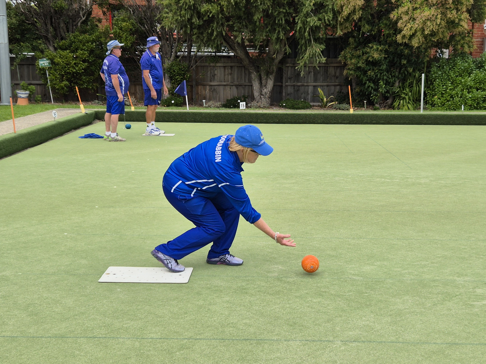

# BowlScore

A comprehensive lawn bowls training and scoring application designed to help bowlers track their performance, practice with structured drills, and maintain detailed game records.



## Features

- **Traditional & Simplified Scorecards** - Track games with multiple players and teams
- **Training Drills** - 40 Bowls Draw, Lead vs Lead, and 2nd's Chance drills
- **Performance Tracking** - Save and analyze your practice sessions
- **Premium Features** - Cloud storage, history, email results, and more
- **Stripe Integration** - Secure subscription management
- **Mobile Responsive** - Works on all devices

## Quick Start

### Prerequisites

- Node.js 18+ and npm
- Supabase account
- Stripe account (for payments)

### Installation

```bash
# Clone the repository
git clone https://github.com/your-org/bowlscore.git
cd bowlscore

# Install dependencies
npm install

# Copy environment template
cp .env.example .env

# Edit .env with your keys
# VITE_SUPABASE_URL=your-url
# VITE_SUPABASE_ANON_KEY=your-key
# VITE_STRIPE_PUBLISHABLE_KEY=your-key

# Start development server
npm run dev
```

Visit `http://localhost:5173` to see the app.

### Database Setup

```bash
# Install Supabase CLI
npm install -g supabase

# Link to your project
supabase link --project-ref your-project-ref

# Run migrations
supabase db push
```

## Documentation

Comprehensive documentation is available in the `/docs` folder:

### 📖 Core Documentation
- **[README](./docs/README.md)** - Documentation overview and navigation
- **[Project Roadmap](./docs/bowlscore-roadmap.md)** - Vision, status, and future plans
- **[Features](./docs/features.md)** - Complete feature list and user guides

### 🏗️ Technical Documentation
- **[Architecture](./docs/architecture.md)** - System design and architectural decisions
- **[Database Schema](./docs/database-schema.md)** - Complete database documentation
- **[Development Guide](./docs/development-guide.md)** - How to develop and contribute

### 🚀 Operations Documentation
- **[Deployment Guide](./docs/deployment.md)** - How to deploy and configure

## Tech Stack

### Frontend
- React 18.3 with TypeScript
- Vite 5.4 (build tool)
- Tailwind CSS 3.4
- React Router 7.9

### Backend
- Supabase (PostgreSQL, Auth, Storage, Edge Functions)
- Stripe (payments)
- Deno (edge function runtime)

### Deployment
- Frontend: Vercel or Netlify
- Backend: Supabase Platform

## Development

```bash
# Start development server
npm run dev

# Type checking
npm run typecheck

# Linting
npm run lint

# Build for production
npm run build

# Preview production build
npm run preview
```

## Project Structure

```
bowlscore/
├── docs/                   # Documentation
├── public/                 # Static assets
├── src/
│   ├── components/         # React components
│   ├── contexts/           # React contexts
│   ├── hooks/              # Custom hooks
│   ├── lib/                # Utilities
│   ├── pages/              # Page components
│   └── ...
├── supabase/
│   ├── functions/          # Edge functions
│   └── migrations/         # Database migrations
└── ...
```

## Key Features

### Scorecards
- **Traditional Scorecard**: Full-featured with 1-4 players per team, handicaps, 1-21 ends
- **Simplified Scorecard**: Quick scoring for casual games
- **JPEG Export**: Download high-resolution images
- **Email Delivery**: Send results directly (Premium)
- **Cloud Saving**: Access history from anywhere (Premium)

### Training Drills

#### 40 Bowls Draw Drill
- 10 ends with alternating hands
- Success/miss tracking
- Detailed statistics
- Session history (Premium)

#### Lead vs Lead Drill
- Head-to-head competition
- Points system with penalties
- Weather and conditions tracking
- Game history (Premium)

#### 2nd's Chance Drill
- Alternating hand practice
- Strict success criteria
- Hand-specific statistics
- Session tracking (Premium)

### Premium Features
- Unlimited session history
- Cloud storage
- Email results
- Download high-res images
- Priority support

## Contributing

We welcome contributions! Please see our [Development Guide](./docs/development-guide.md) for details on:
- Setting up your development environment
- Code standards and best practices
- Testing procedures
- Submitting pull requests

## Support

- **Documentation**: [/docs](./docs/)
- **Issues**: GitHub Issues
- **Email**: support@bowlscore.com

## License

[Add your license here]

## Acknowledgments

Built with:
- [React](https://react.dev/)
- [Supabase](https://supabase.com/)
- [Tailwind CSS](https://tailwindcss.com/)
- [Vite](https://vitejs.dev/)
- [Stripe](https://stripe.com/)

---

**Version**: 1.2.0

**Last Updated**: November 2024

For detailed documentation, see [docs/README.md](./docs/README.md)
